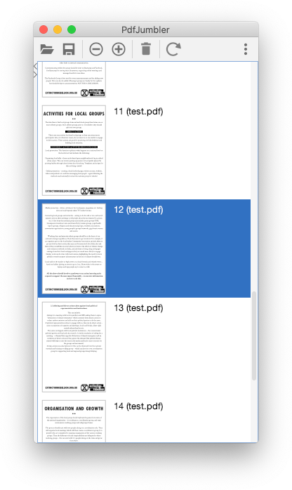

PdfJumbler
==========

[](https://travis-ci.org/mgropp/pdfjumbler)

PdfJumbler simple tool to rearrange, merge, delete, and rotate pages from PDF files. 

Releases
--------

* v0.3.0:
  * https://github.com/mgropp/pdfjumbler/releases/download/v0.3.0/pdfjumbler.jar
  * https://github.com/mgropp/pdfjumbler/releases/download/v0.3.0/setup-pdfjumbler.exe
* v0.2.0: https://github.com/mgropp/pdfjumbler/releases/download/v0.2.0/pdfjumbler.jar

Installation
------------
PdfJumbler requires a Java Runtime Environment (JRE), version 11 or above.
You can download one at <https://adoptopenjdk.net/>.

Windows users can simply download and run the installer (setup-pdfjumbler.exe),
which creates a start menu entry for PdfJumbler.

Alternatively, there is a runnable jar file (just double-click), pdfjumbler.jar.


User Interface
--------------



The user interface is actually rather simple:
pages can be moved around using drag&drop (or the
keyboard, see below), and for more complex operations
there's a second page list available to the left
(just pull it out).


Keyboard Shortcuts
------------------
* Ctrl+O       Open file
* Ctrl+S       Save file
* \+           Zoom in
* \-           Zoom out
* Alt+Up       Move page up
* Alt+Down     Move page down
* Del          Delete page
* Ctrl+Z       Undo
* Ctrl+Y       Redo
* Ctrl+R       Rotate clockwise
* Ctrl+Shift+R Rotate counter-clockwise


Command Line
------------
PdfJumbler accepts pdf files as command line arguments.

Several settings can be changed using Java system properties:

* `pdfjumbler.editor`: sets the editor plugin (if installed; previous plugins are no longer supported)
	 * PDFBox: `net.sourceforge.pdfjumbler.pdfbox.PdfEditor`

* `pdfjumbler.renderer`: sets the renderer plugin (if installed; previous plugins are no longer supported)
	 * PDFBox: `net.sourceforge.pdfjumbler.pdfbox.PdfRenderer`

* `user.language`: sets the program language (in case auto-detection doesn't work).
	So far, `de` (German), `es` (Spanish), `ru` (Russian) and `en` (English; default)
	localizations are available.

### Example ###
```
java -Duser.language=es -jar pdfjumbler.jar foo.pdf bar.pdf
```
